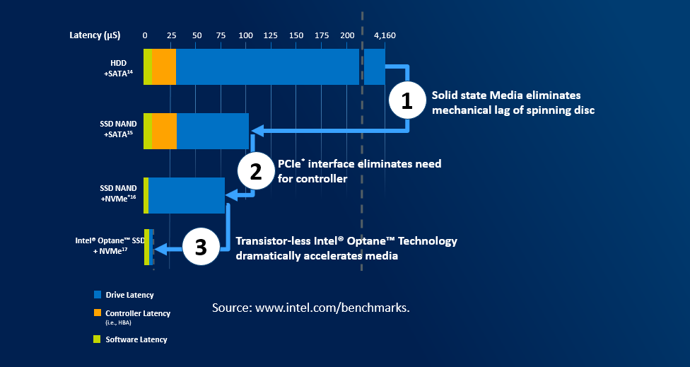
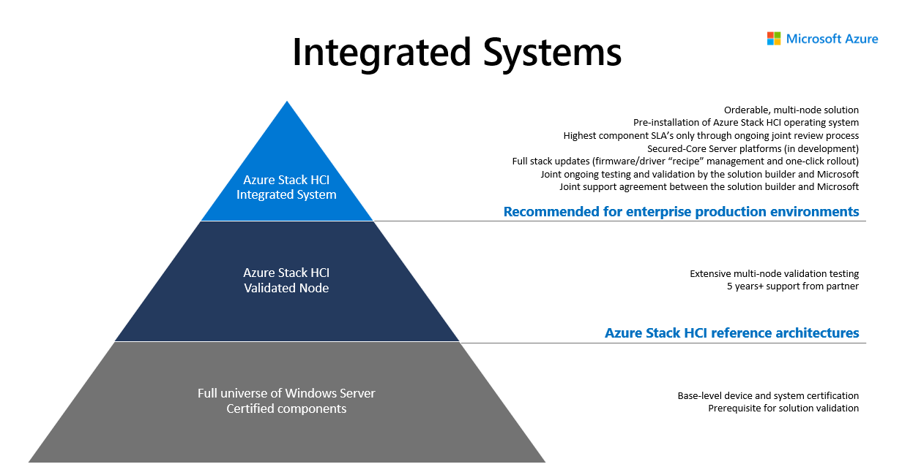

# Planning hardware

## CPU

In hyperconverged systems, CPU handles both VMs and Storage. Rule of thumb is that each logical processor can handle ~60MiB IOPS. Let's calculate an exaple: four node cluster, each node two twelve-core CPUs results. If we consider 4k IOPS, each LP can handle ~15k IOPS. With 4 nodes, 24 LPs each it results in ~1.5M IOPS. All assuming that CPU is used for IO operations only.

## Storage devices

In general, there are two kinds of devices - spinning media and solid state media disks. We all know this story as it's been some time we upgraded our PCs with SSDs and we were able to see the significant latency drop. There are two factors though - type of media (HDD or SSD) and type of bus (SATA, SAS, NVMe or Storage Class Memory -SCM).

HDD mediatype is always using SATA or SAS. And this type of bus was more than enough for it's purpose. With introduction of SSD mediatype, SATA/SAS started to show it's limitation. Namely with SATA/SAS you will utilize 100% of your CPU and you will not be able to reach more than ~300k IOPS. It's because SATA/SAS was designed for spinning media and also one controller connects multiple devices to one PCIe connection. NVMe was designed from scratch for low latency and parallelism and has dedicated connection to PCIe. Therefore NAND NVMe outperforms NAND SATA/SAS SSD drive.

Another significant leap was introduction of Intel Optane SSD, that introduces even lower latencies than NAND SSDs. And since in Optane media is bit addressable, there is no garbage to collect (on NAND SSD you erase only in blocks with negative performance impact).

Important piece when selecting storage devices is, that if you consider SSD+HDD combination, all heavy lifting will end up in one SATA/SAS controller connected into one PCIe slot. Therefore it's recommended to consider using NVMe instead, as each NVMe will have its PCIe line.

## Network cards

There are several considerations when talking about network cards.

### Network Interface Speed

Network Cards are coming in speeds ranging from 1Gbps to 200Gbps. While hyperconverged infrastructure will work with 1Gbps, the performance will be limited. The requirement is to have at least one 10Gbps port per server. However it's recommended to have at least 2x10Gbps with RDMA enabled.

| Mediatype | Recommended NICs |
|:--------------|:-----------------------|
|SSD as cache or SSD all-flash  | 2×10 Gbps or 2x25Gbps |
|NVMe as cache  | 2-4×25Gbps or 2×100Gbps |
|NVMe all-flash | 2-4×25Gbps or 2×100Gbps |
|Optane as cache| 2-4×100 Gbps or 2×200Gbps |

### Use of RDMA

When RDMA is enabled, it will bypass networking stack and DMA directly into memory of NIC. This will significantly reduce CPU overhead. While RDMA is not mandatory, it's highly recommended for Azure Stack HCI as it will leave more CPU for Virtual Machines and Storage.

### RDMA protocol

There are two flavors of RDMA. iWARP (TCP/IP) and RoCE (UDP). The main difference a need of lossless infrastructure for RoCE as when switch is loaded and starts dropping packets, it cannot prioritize or even notify infrastructure to stop sending packets if DCB/PFC/ETS is not configured. When packet is dropped on UDP, large retransmit needs to happen and this cause even higher load on switches. Retransmit will also happen on TCP/IP, but significantly smaller. It is still recommended to configure PFC/ETS on both if possible - in case switch needs to notify infrastructure to stop sending packets.

## Network infrastructure

Reliable, low latency infrastructure is a must for reliable function of Converged and HyperConverged infrastructure. As already covered above, DCB (PFC nad ETS) is recommended for iWARP and required for RoCE. There is also alternative - starting Windows Server 2019, direct connection is supported. As you can see, it does not make sense to have more than 5 nodes in the cluster (with increasing number of interconnects)

| Number of nodes | Number of direct connections |
|:-----------------------------|:----------------|
| 2 | 1 |
| 3 | 3 |
| 4 | 6 |
| 5 | 10 |

>Note: Dell supports up to 4 nodes in switchless configuration

## Hardware certification programme

It is very important to follow validated hardware path. This way you can avoid ghost hunting when single component will misbehave due to firmware or even hardware not being able to handle load under high pressure. There is very good blog summarizing importance of validated hardware [part1](https://cloudblogs.microsoft.com/windowsserver/2018/02/20/the-technical-value-of-wssd-validated-hci-solutions-part-1/) [part2](https://cloudblogs.microsoft.com/windowsserver/2018/02/21/the-technical-value-of-validated-hci-solutions-part-2/). Validated solutions are available in [Azure Stack HCI Catalog](https://www.microsoft.com/en-us/cloud-platform/azure-stack-hci-catalog). For Azure Stack HCI you can also consider [Integrated System](https://hcicatalog.azurewebsites.net/#/?IntegratedSystem=Integrated+System) which includes the Azure Stack HCI operating system pre-installed as well as partner extensions for driver and firmware updates.

>Note: Dell sells only Integrated Systems as Microsoft highly recommend those over just verified solutions.

